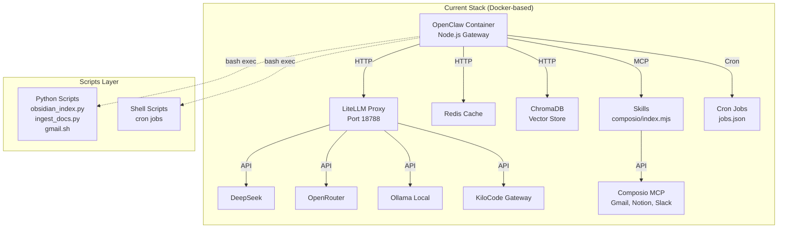
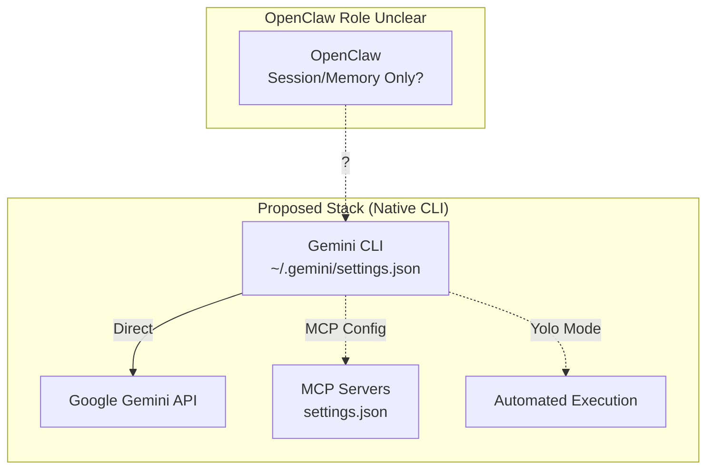

# OpenClaw → Gemini CLI Migration Analysis

## Executive Summary

This analysis evaluates the feasibility and impact of replacing the current LiteLLM-based OpenClaw stack with a Gemini CLI-centric architecture. **Recommendation: DO NOT migrate entirely** — the proposed change would create significant architectural mismatches and reduce system capabilities.

---

## 1. Current Architecture Overview



### Current Components

| Component | Purpose | Technology |
|-----------|---------|------------|
| OpenClaw Gateway | Main orchestrator, session/memory management | Node.js |
| LiteLLM Proxy | Unified LLM routing, fallbacks, load balancing | Python/FastAPI |
| Redis | Session caching | In-memory |
| ChromaDB | Vector storage for RAG | Python |
| Skills (Composio) | MCP-based tool integration | Node.js |
| Cron Jobs | Scheduled automation | JSON-defined |
| Python Scripts | Document indexing, Gmail API, Chroma ingestion | Python 3.11 |

---

## 2. Proposed Architecture Analysis



---

## 3. Performance Comparison

### 3.1 Request Latency

| Scenario | Current (LiteLLM) | Proposed (Gemini CLI) | Winner |
|----------|-------------------|----------------------|--------|
| **First Token Latency** | ~50-100ms overhead + model time | ~20-50ms (direct API) | Gemini CLI |
| **Throughput** | 1 concurrent (num_workers=1) | Unknown, likely higher | Gemini CLI |
| **Cold Start** | Container boot ~2-5s | Native CLI ~instant | Gemini CLI |
| **Multi-model Routing** | Zero overhead (already proxied) | Would need custom logic | LiteLLM |
| **Local Models (Ollama)** | Direct container→host | Would need subprocess calls | LiteLLM |

### 3.2 System Overhead

| Aspect | Current | Proposed |
|--------|---------|----------|
| **Memory Usage** | ~2GB (Redis + LiteLLM + OpenClaw) | ~500MB (just Gemini CLI) |
| **CPU Usage** | LiteLLM proxy adds ~5-10% | Lower (no proxy) |
| **Docker Overhead** | Yes, but isolated and reproducible | None, but host pollution risk |

### 3.3 Verdict on Performance

**Gemini CLI would be faster for single-model, direct API calls.** However, the current setup's overhead is negligible compared to LLM API latency (100-3000ms). The performance gain is marginal and doesn't justify architectural disruption.

---

## 4. Architecture Fit Analysis

### 4.1 Critical Mismatches

| Feature | OpenClaw Expectation | Gemini CLI Reality |
|---------|---------------------|-------------------|
| **Model Routing** | Dynamic model selection per agent (13+ models configured) | Single model per session |
| **Multi-provider** | DeepSeek, OpenRouter, Ollama, KiloCode, Bailian | Google Gemini only |
| **Agent System** | Dedicated agents with model configs (career, investor) | No native agent concept |
| **Session Persistence** | Redis-backed, cross-conversation memory | Local session only |
| **Cron Jobs** | JSON-defined, isolated sessions | No native cron support |
| **Skill System** | MCP + custom Node.js skills | MCP only via config |
| **Gateway API** | REST API for external integration | CLI-only interface |

### 4.2 OpenClaw Core Functions vs Gemini CLI

```
┌─────────────────────────────────────────────────────────────────┐
│ OpenClaw Core Functionality          │ Gemini CLI Equivalent    │
├─────────────────────────────────────────────────────────────────┤
│ Session/memory management            │ ❌ Not available         │
│ Multi-model agent routing            │ ❌ Not available         │
│ Cron job orchestration               │ ❌ Not available         │
│ Skill loading system (index.mjs)     │ ❌ Not available         │
│ REST API gateway                     │ ❌ Not available         │
│ Telegram bot integration             │ ❌ Not available         │
│ ChromaDB vector search integration   │ ❌ Not available         │
│ Python script execution environment  │ ❌ Not available         │
│ OAuth token management               │ ❌ Not available         │
└─────────────────────────────────────────────────────────────────┘
```

### 4.3 What "OpenClaw as Command Center" Actually Means

The proposal suggests OpenClaw handles "session/memory management" while Gemini CLI handles LLM calls. This creates a **fundamental architectural disconnect**:

1. **Memory Integration**: OpenClaw's memory system injects context into LLM prompts. If Gemini CLI is making the API calls, OpenClaw cannot inject context.

2. **Tool Use**: OpenClaw's skill system (like `composio/index.mjs`) provides tools to the LLM. Gemini CLI has its own MCP configuration — these would be separate, conflicting systems.

3. **Response Handling**: OpenClaw parses LLM responses to execute skills. With Gemini CLI, the CLI would need to return structured data that OpenClaw can parse, which is not a supported workflow.

---

## 5. Python Scripts Assessment

### 5.1 Script Inventory & Purpose

| Script | Purpose | Gemini CLI Replacement? |
|--------|---------|------------------------|
| `obsidian_index.py` | FTS5 indexing of Obsidian vault | ❌ No — requires SQLite + Python libs |
| `ingest_docs.py` | ChromaDB document ingestion with embeddings | ❌ No — requires ChromaDB client + Ollama |
| `gmail.sh` | Gmail API wrapper | ⚠️ Partial — Composio has Gmail, but loses custom logic |
| `gcal.sh` | Google Calendar API | ⚠️ Partial — Composio has GCal |
| `obsidian_query.py` | Vault search queries | ❌ No — requires Python SQLite |
| `google_auth.py` | OAuth token management | ❌ No — required for API access |
| `crash_analyzer.sh` | Log analysis | ⚠️ Could be moved, but loses integration |
| `watchdog.sh` | Container health monitoring | ❌ No — requires Docker access |
| `jobs/*.sh` | Cron job scripts | ❌ No — Gemini CLI has no cron system |

### 5.2 Verdict on Python Scripts

**Most scripts CANNOT be replaced.** They depend on:
- Direct file system access to Obsidian vault
- ChromaDB client libraries
- Google OAuth flows
- Docker socket access
- SQLite operations

Keeping the scripts means keeping the Docker container, which negates the "simplify" goal.

---

## 6. Pros and Cons

### 6.1 Advantages of Migration

| Benefit | Details | Weight |
|---------|---------|--------|
| Reduced memory footprint | ~1.5GB savings | Medium |
| Simpler LLM configuration | Single settings.json | Low |
| "Yolo Mode" automation | Ctrl+Y for background ops | Medium |
| Native Gemini features | 2M context, grounding, search | High |
| Faster cold starts | No container boot | Low |

### 6.2 Disadvantages of Migration

| Drawback | Details | Weight |
|----------|---------|--------|
| **Single provider lock-in** | Lose DeepSeek, OpenRouter, Ollama, etc. | **Critical** |
| **Loss of agent system** | Career, investor agents would need rebuilding | **Critical** |
| **No session/memory management** | Core OpenClaw feature eliminated | **Critical** |
| **Cron jobs broken** | No scheduled automation | **Critical** |
| **Skills system incompatible** | Custom Node.js skills don't work with Gemini CLI | **Critical** |
| **Python scripts stranded** | Would need separate hosting | High |
| **ChromaDB integration lost** | No vector RAG | High |
| **Telegram bot broken** | No notification system | High |
| **Complex migration effort** | Weeks of work, uncertain outcome | Medium |

---

## 7. Migration Complexity

### 7.1 Required Changes

| System | Current | To Gemini CLI | Effort |
|--------|---------|---------------|--------|
| LLM Routing | LiteLLM config.yaml | settings.json MCP | 1 day |
| Multi-model support | 13 models | 1 model | Lose functionality |
| Agent configs | models.json per agent | None | Rebuild entirely |
| Session/memory | Redis-backed | ? Unknown | Major R&D |
| Cron jobs | Native JSON | External cron + scripts | 3-5 days |
| Skills | Node.js MCP | Gemini MCP config | Lose custom logic |
| Python scripts | In-container | Host-based | 2-3 days |
| Telegram | OpenClaw native | ? Need new bot | 2-3 days |
| ChromaDB | Native integration | ? Need new client | 2-3 days |

### 7.2 Estimated Migration Effort

- **Minimum viable**: 2-3 weeks full-time
- **Feature parity**: Likely impossible (fundamental architectural differences)
- **Risk level**: Very High

---

## 8. Alternative Recommendations

Instead of replacing the entire stack, consider these incremental improvements:

### Option A: Add Gemini as an Additional Provider (Recommended)

```yaml
# Add to litellm/config.yaml
- model_name: gemini/gemini-2.0-flash
  litellm_params:
    model: gemini/gemini-2.0-flash
    api_key: os.environ/GEMINI_API_KEY
```

**Benefits**:
- Keep all existing functionality
- Access Gemini's features when needed
- Zero disruption

### Option B: Optimize Current Stack

1. **Reduce LiteLLM workers**: Currently 1, could tune
2. **Redis memory limit**: Already at 512MB, good
3. **Consider LiteLLM native mode**: Remove Docker for LiteLLM only

### Option C: Hybrid Approach (Future)

Use Gemini CLI for specific "yolo mode" tasks while keeping OpenClaw for orchestration:

```bash
# Example: Specific automated tasks use Gemini CLI
# But OpenClaw remains the coordinator
```

---

## 9. Final Recommendation

### ❌ DO NOT MIGRATE to Gemini CLI as proposed

**Rationale**:

1. **Architectural Mismatch**: The proposal fundamentally misunderstands OpenClaw's role. OpenClaw is not just a "command center" — it's an integrated orchestrator that manages sessions, memory, routing, skills, and jobs.

2. **Loss of Critical Features**: You would lose:
   - Multi-model support (13 → 1 model)
   - Agent system (career, investor agents)
   - Session/memory persistence
   - Cron job automation
   - Custom skill system
   - ChromaDB RAG
   - Telegram integration

3. **Python Scripts Cannot Migrate**: 15+ scripts depend on the Docker environment. Moving them to host creates maintenance headaches.

4. **Marginal Performance Gain**: The speed improvement is insignificant compared to LLM API latency.

5. **Provider Lock-in**: Tying everything to Google Gemini loses the flexibility of your current multi-provider setup.

### ✅ Recommended Actions

1. **Add Gemini as a LiteLLM provider** — get Gemini's benefits without disruption
2. **Profile current performance** — identify actual bottlenecks
3. **Consider container-less LiteLLM** — if Docker overhead is the concern
4. **Wait for OpenClaw native Gemini integration** — if it's on their roadmap

---

## Appendix: Detailed Component Analysis

### A.1 OpenClaw Gateway Dependencies

The OpenClaw container (`openclaw-latest`) requires:
- Node.js runtime
- Python 3.11 (for script execution)
- Docker socket access (for container management)
- File system mounts (Obsidian vault, bot project)

### A.2 Current LLM Provider Configuration

| Provider | Models | Use Case |
|----------|--------|----------|
| DeepSeek | deepseek-chat, deepseek-reasoner | General reasoning |
| OpenRouter | Multiple DeepSeek variants | Fallback routing |
| KiloCode | kimi-k2.5:free | Free tier reasoning |
| Bailian | qwen3.5-plus, qwen3-max | Chinese/English |
| Ollama | Local models (qwen, deepseek) | Offline/Privacy |
| MiniMax | MiniMax-M2.5 | Via OAuth portal |

All of these would be lost with Gemini CLI.

### A.3 Skill System Architecture

Current skills are Node.js modules loaded by OpenClaw:
- `composio/index.mjs` — Universal tools via Composio MCP
- Custom skills can be added to `skills/` directory
- Skills have access to OpenClaw's context and memory

Gemini CLI's MCP is configuration-only and cannot run custom Node.js logic.
