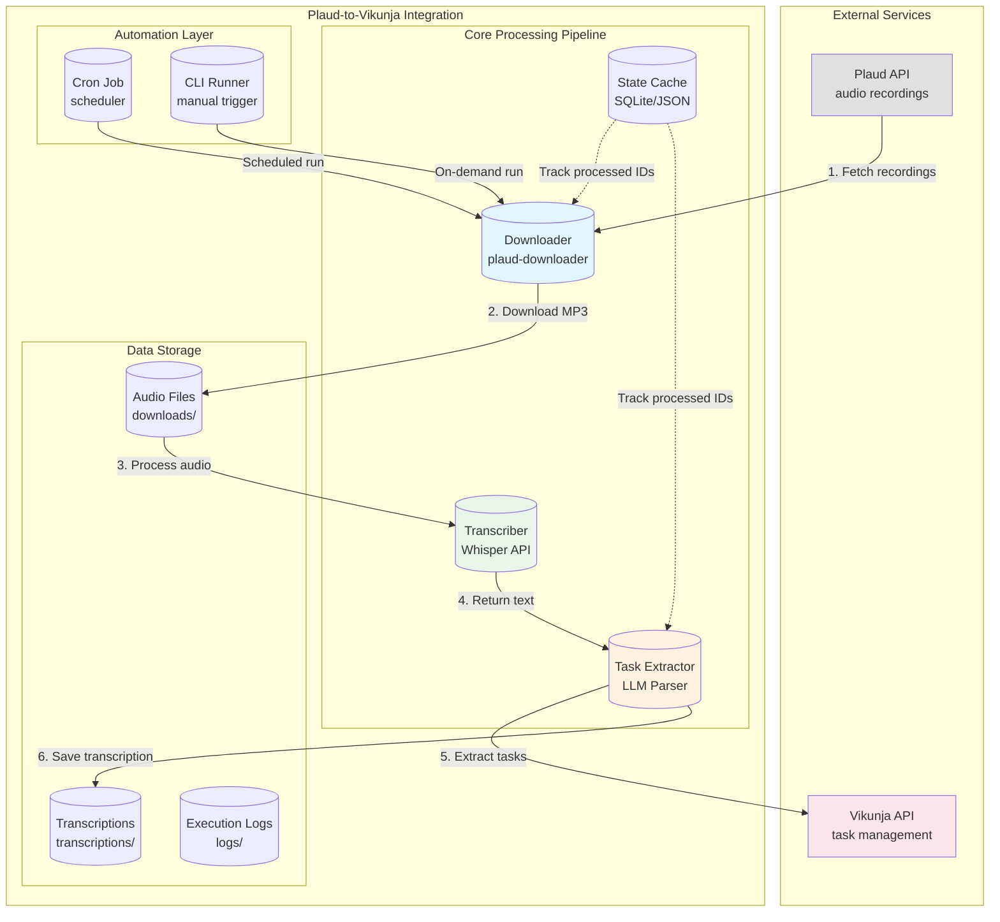
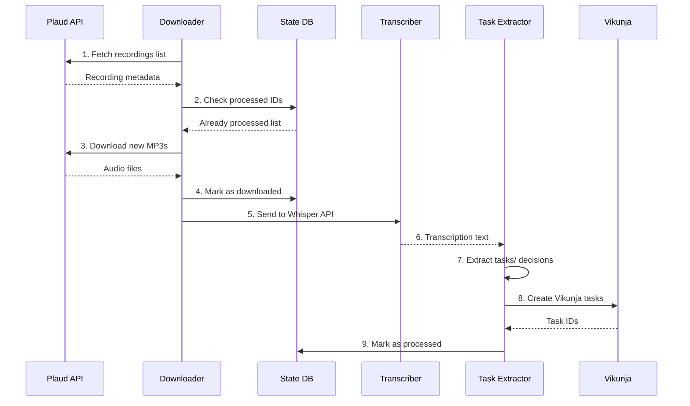

# Plaud-to-Vikunja Workflow Integration Architecture

## Overview

This document describes the architecture for a workflow integration that automatically downloads Plaud audio recordings, transcribes them, extracts action items and tasks, and creates tasks in Vikunja task manager.

## Architecture Diagram



## Component Breakdown

### 1. Audio Download Module

**Location:** `plaud-downloader/download.py`

The existing Plaud downloader will be enhanced with new capabilities:

| Feature | Current State | Enhancement Needed |
|---------|--------------|-------------------|
| Token-based auth | ✅ Working | None |
| List recordings | ✅ Working | Add date filtering |
| Download MP3 | ✅ Working | Add incremental sync |
| Output directory | ✅ `downloads/` | Support custom path |

**Enhancement Requirements:**
- Add `--since` flag to download only new recordings since last run
- Add `--processed-db` flag to track processed recording IDs
- Output JSON manifest of downloaded files for pipeline integration

### 2. Transcription Module

**Technology Comparison:**

| Option | Pros | Cons | Recommendation |
|--------|------|------|----------------|
| **OpenAI Whisper API** | High accuracy, fast, no GPU needed | Cost per minute | ✅ Recommended for production |
| **Local Whisper (tiny/base)** | Free, runs offline | Slower, requires CPU/GPU | Good for development/testing |
| **Faster Whisper + CTranslate2** | Fast, accurate | Requires GPU setup | Consider for high volume |
| **Google Cloud Speech** | Enterprise-grade | Cost, setup complexity | Overkill for this use case |

**Recommendation: OpenAI Whisper API**

- **Model:** `whisper-1`
- **Language:** Auto-detect or configurable
- **Cost:** ~$0.006/minute (very affordable)
- **Output format:** JSON with segments

**Implementation:**
```python
# transcription/transriber.py
importc openai

class WhisperTranscriber:
    def __init__(self, api_key: str, model: str = "whisper-1"):
        self.client = openai.OpenAI(api_key=api_key)
        self.model = model
    
    def transcribe(self, audio_path: str) -> dict:
        with open(audio_path, "rb") as f:
            response = self.client.audio.transcriptions.create(
                model=self.model,
                file=f,
                response_format="verbose_json"
            )
        return {
            "text": response.text,
            "segments": response.segments,
            "duration": response.duration
        }
```

### 3. Task Extraction Module

The task extraction module uses an LLM to parse transcriptions and identify:

| Category | Examples | Vikunja Mapping |
|----------|----------|-----------------|
| **Tasks** | "I need to call John", "send the report" | Priority 2, Standard task |
| **Decisions** | "We decided to launch on Friday" | Priority 1, Add [DECISION] prefix |
| **Action Items** | "Alice will prepare the slides" | Assign to project, priority based on urgency |
| **Meetings** | "Next meeting Tuesday 3pm" | Create reminder task |
| **Deadlines** | "Report due by Friday" | Set due_date |

**Extraction Prompt:**

```
You are a task extraction system. Analyze the following meeting transcription 
and extract actionable items. Return a JSON array of tasks.

For each task, extract:
- title: Brief task description (max 100 chars)
- description: Full context from transcript
- due_date: Any mentioned deadlines (YYYY-MM-DD format)
- priority: 1=low, 2=medium, 3=high
- type: "task" | "decision" | "reminder"

Transcription:
{transcript}

Return valid JSON only:
```

**Vikunja Task Creation Mapping:**

```python
# Convert extracted task to Vikunja format
def to_vikunja_task(extracted_task: dict) -> dict:
    priority_map = {"low": 1, "medium": 2, "high": 3}
    return {
        "title": format_title(extracted_task),
        "description": f"{extracted_task['description']}\n\n---\nSource: Plaud Recording",
        "due_date": extracted_task.get("due_date"),
        "priority": priority_map.get(extracted_task.get("priority", "medium"), 2)
    }
```

### 4. Vikunja API Integration

**Existing Integration:** [`openclaw-docker/skills/vikunja/vikunja.sh`](openclaw-docker/skills/vikunja/vikunja.sh)

The existing bash script provides these endpoints:
- `create` - Create task with title, description, due_date, priority
- `create-for-project` - Create task in specific project
- `projects` - List available projects
- `create-project` - Create new project

**API Endpoints Used:**

| Endpoint | Method | Purpose |
|----------|--------|---------|
| `/projects` | GET | List projects (for mapping) |
| `/projects/{id}/tasks` | PUT | Create new task |
| `/tasks/{id}` | POST | Update task |
| `/tasks/{id}` | DELETE | Remove duplicate |

**Task Creation Flow:**

```bash
# Using existing vikunja.sh
VIKUNJA_TOKEN="$VIKUNJA_TOKEN" \
VIKUNJA_URL="http://vikunja:3456/api/v1" \
bash vikunja.sh create-for-project \
    "$PROJECT_ID" \
    "[AUDIO] Task title" \
    "Full description from transcript..." \
    "2024-01-15" \
    2
```

## File Structure

```
plaud-vikunja-integration/
├── config/
│   ├── config.yaml           # Main configuration
│   └── .env.example          # Environment template
├── src/
│   ├── __init__.py
│   ├── downloader/
│   │   ├── __init__.py
│   │   ├── enhanced_downloader.py   # Enhanced Plaud downloader
│   │   └── sync_state.py            # Track processed recordings
│   ├── transcription/
│   │   ├── __init__.py
│   │   ├── transcriber.py           # Whisper API wrapper
│   │   └── local_whisper.py         # Local fallback
│   ├── extraction/
│   │   ├── __init__.py
│   │   ├── extractor.py             # LLM-based extraction
│   │   ├── prompts.py               # Extraction prompts
│   │   └── parser.py                # JSON response parser
│   ├── vikunja/
│   │   ├── __init__.py
│   │   ├── client.py                # Python Vikunja client
│   │   └── task_mapper.py           # Task format conversion
│   └── pipeline/
│       ├── __init__.py
│       ├── runner.py                # Main orchestration
│       └── scheduler.py             # Cron integration
├── scripts/
│   ├── run_pipeline.sh              # Manual execution
│   ├── setup_cron.sh                # Cron setup
│   └── test_transcription.sh        # Test transcription
├── tests/
│   ├── test_extraction.py
│   └── test_vikunja_integration.py
├── downloads/                        # Audio files (existing)
├── transcriptions/                   # Transcription output
│   └── .gitkeep
├── logs/                             # Execution logs
│   └── .gitkeep
├── requirements.txt
├── README.md
└── main.py                           # Entry point
```

## Configuration Requirements

### Environment Variables

```bash
# Plaud Configuration
PLAUD_API_TOKEN=your_plaud_token_here

# Transcription Configuration  
OPENAI_API_KEY=your_openai_key_here
TRANSCRIPTION_MODEL=whisper-1
TRANSCRIPTION_LANGUAGE=auto

# Vikunja Configuration
VIKUNJA_URL=http://localhost:3456/api/v1
VIKUNJA_TOKEN=your_vikunja_token_here
VIKUNJA_DEFAULT_PROJECT_ID=1

# Pipeline Configuration
PROCESSED_DB_PATH=./data/processed.db
LOG_LEVEL=INFO
```

### Configuration File (config.yaml)

```yaml
plaud:
  output_dir: "./downloads"
  output_format: "json"  # json manifest for pipeline
  
transcription:
  provider: "openai"  # or "local"
  model: "whisper-1"
  language: "auto"
  output_dir: "./transcriptions"
  
extraction:
  provider: "openai"  # or "ollama"
  model: "gpt-4o-mini"
  task_prefix: "[AUDIO]"
  extract_types:
    - task
    - decision
    - reminder
    
vikunja:
  url: "http://localhost:3456/api/v1"
  default_project_id: 1
  task_mapping:
    high_priority: 3
    medium_priority: 2
    low_priority: 1
    
pipeline:
  schedule: "0 9 * * *"  # Daily at 9 AM
  processed_db: "./data/processed.db"
  log_level: "INFO"
```

## Implementation Plan

### Phase 1: Core Pipeline (Priority: High)

- [ ] Create project structure and config system
- [ ] Implement enhanced downloader with state tracking
- [ ] Implement Whisper transcription module
- [ ] Implement task extraction with LLM
- [ ] Implement Vikunja task creation
- [ ] Create main pipeline runner

### Phase 2: Automation (Priority: Medium)

- [ ] Create bash wrapper script
- [ ] Setup cron job configuration
- [ ] Add logging and error handling
- [ ] Create health check endpoint

### Phase 3: Enhancements (Priority: Low)

- [ ] Add local Whisper fallback
- [ ] Implement duplicate detection
- [ ] Add retry logic for failed transcriptions
- [ ] Create web dashboard for monitoring

## Data Flow



## Error Handling

| Error Type | Handling Strategy |
|------------|-------------------|
| Plauth API unavailable | Retry 3x with exponential backoff, alert |
| Download fails | Log error, continue with other files |
| Transcription fails | Save to failed queue, retry later |
| LLM extraction fails | Use fallback rules-based parser |
| Vikunja API unavailable | Queue tasks, retry on next run |
| Duplicate task detected | Skip, update existing task |

## Monitoring & Logging

- **Log Location:** `./logs/pipeline-{date}.log`
- **Metrics to Track:**
  - Recordings processed count
  - Transcription success rate
  - Tasks created in Vikunja
  - Processing duration
- **Alerting:** Send notification on pipeline failure

## API Keys Required

| Service | Key Type | Where to Get |
|---------|----------|--------------|
| Plaud | API Token | Plaud app settings |
| OpenAI | API Key | openai.com/api |
| Vikunja | User Token | Vikunja settings |

## Next Steps

1. **Confirm transcription provider** - OpenAI Whisper API vs local Whisper
2. **Define Vikunja project** - Which project should audio tasks go to
3. **Set extraction rules** - What types of items to extract
4. **Schedule preference** - How often to run (daily, hourly, on-demand)

