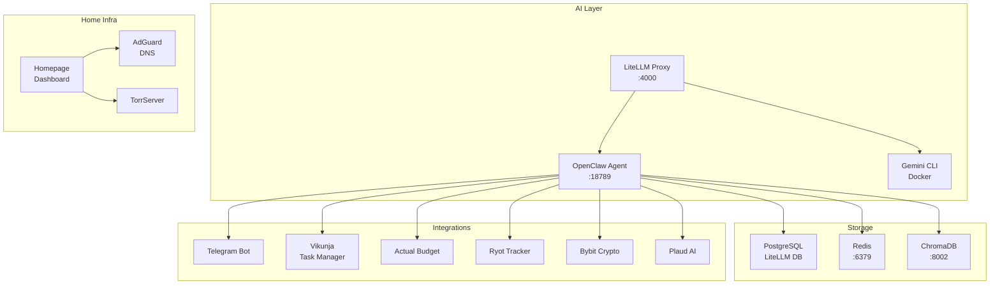

# OpenClaw Docker Project - Полный Анализ

**Дата анализа:** 2026-03-10  
**Статус:** Требует внимания

---

## 📊 Резюме Проекта

Это **очень масштабный AI-агент проект** с более чем:
- **60+ скилов** (skills)
- **10+ агентов** (agents)  
- **40+ скриптов** (scripts)
- **28 промптов** (SOUL файлов)
- **20+ Docker сервисов**

Проект представляет собой **персонального AI-ассистента** на базе MiniMax/Kimi с интеграцией в Obsidian, Telegram, крипто-инструменты и домашнюю инфраструктуру.

---

## 🏗️ Архитектура

### Основные Компоненты



---

## ✅ Что Работает Хорошо

### 1. Docker Compose Инфраструктура

| Сервис | Статус | Порт |
|--------|--------|------|
| LiteLLM Proxy | ✅ Активен | 18788 |
| OpenClaw Agent | ✅ Активен | 18789 |
| ChromaDB | ✅ Активен | 8002 |
| Redis | ✅ Активен | 6379 |
| PostgreSQL | ✅ Активен | 5432 |
| Vikunja | ✅ Активен | 3456 |
| Homepage | ✅ Активен | 3012 |
| Ryot | ✅ Активен | 3014 |
| Actual Budget | ✅ Активен | 5006 |
| AdGuard | ✅ Активен | 80/53 |

### 2. Agents Конфигурация

Все **10 агентов** настроены и используют:
- **Модели:** `kimi-k2.5`, `minimax-portal/MiniMax-M2.5`
- **Системные промпты:** SOUL файлы (28 штук)
- **Инструменты:** exec, read, write, web_search, obsidian_search, vikunja, ryot, email, telegram

**Список агентов:**
- `main` - General Chat (Default)
- `architect` - Software Architecture Expert
- `coder` - DevOps & Backend Engineer
- `research` - Deep Researcher
- `investor` - Investment Analyst
- `pm` - Product Manager
- `career` - Career Coach
- `interviewer` - Interview Trainer
- `trainer` - Learning Coach
- `router` - Task Router

### 3. Core Skills (Основные Скилы)

Отлично документированы и имеют четкую структуру:

| Skill | Описание | Статус |
|-------|---------|--------|
| `proactive-agent` | Proactive architecture v3.1 | ✅ Актуально |
| `skill-development` | Как создавать скилы | ✅ Актуально |
| `python-coding` | Python стандарты | ✅ Актуально |
| `agent-memory` | ChromaDB memory layer | ✅ Актуально |
| `debate` | Multi-agent debate | ✅ Актуально |
| `crypto_monitor` | Crypto alerts & tracking | ✅ Актуально |
| `bybit_integration` | Bybit API integration | ✅ Актуально |

### 4. Lossless-Claw Extension

**Плагин для управления контекстом** - очень важный компонент:
- Компакция контекста (context compaction)
- Summarization через LLM
- Сохранение важной информации при длинных сессиях
- SQLite база данных в `~/.openclaw/lcm.db`

### 5. Cron Jobs (Автоматизация)

Более **15 автоматических задач**:
- Morning digest
- Daily reports
- Crypto monitoring
- Obsidian reindex
- Git backup
- Finance enrichment
- Telegram monitoring

---

## ⚠️ Проблемы и Рекомендации

### 🔴 Критические Проблемы

#### 1. **Совместимость с Claude Code v3**

**Проблема:** Проект использует **OpenClaw** (форк Claude Code), но:

- `CLAUDE_API_KEY` в `.env` **пустая** - нет интеграции с официальным Claude Code
- Lossless-claw extension - это **кастомное решение** для управления памятью
- Claude Code v3 имеет **новые возможности MCP серверов** и улучшенный context management

**Рекомендация:**
```
1. Добавить Claude API Key в .env
2. Рассмотреть миграцию на нативный Claude Code v3 с MCP серверами
3. Обновить lossless-claw для совместимости с v3
```

#### 2. **Устаревшие или Неиспользуемые Скилы**

Из 60+ скилов многие могут быть устаревшими:

**Подозрительные скилы (требуют проверки):**
- `lobehub-skills-search-engine` - специфичный для lobehub
- `marketing-psychology` - без обновлений
- `pm-skills/*` - 7 скилов для PM, могут дублировать функциональность
- `visual-explainer` - без понятного применения
- `status` - непонятное назначение
- `🛡️ proactive-agent` - дубликат в папке с emoji

**Рекомендация:** Создать inventory всех скилов и пометить неиспользуемые.

#### 3. **Security Concerns**

- Много **API ключей** в `.env` файле (Groq, DeepSeek, OpenRouter, Bybit, и т.д.)
- Некоторые ключи **могут быть устаревшими**
- `sudo_approve.sh` скрипт выполняет sudo команды

**Рекомендация:**
- Использовать Docker secrets для критичных переменных
- Ротировать API ключи
- Проверить какие ключи реально используются

### 🟡 Среднего Приоритета

#### 4. **Модели и Провайдеры**

Текущая конфигурация:
```json
{
  "main": "kimi-k2.5",
  "research": "minimax-portal/MiniMax-M2.5",
  "coder": "kimi-k2.5"
}
```

**Проблемы:**
- Kimi и MiniMax могут быть **нестабильны** или иметь rate limits
- Нет fallback на OpenAI/Anthropic при сбоях
- LiteLLM proxy настроен, но не использует все возможности

**Рекомендация:**
- Добавить fallback модели
- Настроить retry логику в LiteLLM
- Рассмотреть добавление Claude/GPT как резервных

#### 5. **Scripts - Дублирование Функциональности**

Многие скрипты делают похожие вещи:

| Группа | Скрипты | Проблема |
|--------|---------|----------|
| Obsidian | `obsidian_index.py`, `obsidian_search.py`, `obsidian_query.py`, `obsidian_rag_search.sh`, `obsidian_search.sh` | 5 инструментов для поиска |
| Email | `email_imap.py`, `gmail.sh` | Перекрываются |
| Jobs | 15+ cron jobs | Некоторые могут конфликтовать |

#### 6. **Docker Compose - Дублирование Сервисов**

В `docker-compose.yml`, `docker-compose.apps.yml`, `docker-compose.home.yml`:
- **beszel** определен 2 раза
- **cloudflared** определен 2 раза
- Возможны конфликты портов

---

### 🟢 Улучшения

#### 7. **MCP Servers - Не Используются**

Проект не использует **Model Context Protocol** (MCP), который является стандартом в Claude Code v3.

**Рекомендация:**
- Добавить MCP серверы для:
  - Filesystem
  - Git
  - Docker
  - PostgreSQL
  - Custom integrations

#### 8. **Monitoring и Health Checks**

Часть сервисов **не имеет health checks**:
- `openclaw` - ✅ есть
- `litellm` - ✅ есть
- `n8n` - ✅ есть
- `gemini-cli` - ❌ нет
- `searxng` - ✅ есть
- `actual-budget` - ✅ есть

#### 9. **Workspace Разделение**

Много workspace директорий:
- `workspace-main/`
- `workspace-coder/`
- `workspace-researcher/`
- `workspace-investor/`
- `workspace-career/`
- `workspace-interviewer/`
- `workspace-trainer/`
- `workspace-work/`
- `workspace-analyst/`
- `workspace-architect/`

**Рекомендация:** Консолидировать или документировать назначение каждого.

---

## 📋 План Действий

### Мини-Таски (Приоритет)

#### 🔥 Срочно
1. **[ ]** Добавить `CLAUDE_API_KEY` в `.env`
2. **[ ]** Проверить работоспособность всех ключевых интеграций
3. **[ ]** Удалить дубликаты Docker сервисов (beszel, cloudflared)

#### ⚡ Важно
4. **[ ]** Инвентаризация скилов - пометить неиспользуемые
5. **[ ]** Ротировать устаревшие API ключи
6. **[ ]** Настроить резервные модели в LiteLLM

#### 📌 На будущее
7. **[ ]** Консолидировать скрипты (obsidian, email)
8. **[ ]** Добавить MCP серверы
9. **[ ]** Документировать workspaces
10. **[ ]** Обновить health checks для всех сервисов

---

## 📊 Статистика Проекта

| Метрика | Количество |
|---------|------------|
| Skills | 60+ |
| Agents | 10 |
| SOUL Prompts | 28 |
| Scripts | 40+ |
| Docker Services | 20+ |
| API Keys | 25+ |
| Cron Jobs | 15+ |
| Workspaces | 10+ |

---

## 🎯 Вывод

Проект **очень мощный и комплексный**, но требует:

1. **Технического обслуживания** - много дублирующей функциональности
2. **Аудита безопасности** - проверить API ключи
3. **Миграции на Claude Code v3** - добавить поддержку MCP
4. **Оптимизации** - удалить неиспользуемые компоненты

**Общая оценка:** 7/10 - Работает, но требует внимания

---

*Анализ проведен: 2026-03-10*
