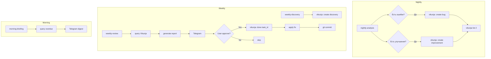

# Vikunja Task Tracker — Полная интеграция с ночными агентами

## Цель

Создать систему трекинга задач на базе Vikunja для замены файловых уведомлений от ночных агентов. Все ошибки, улучшения и идеи автоматически должны превращаться в задачи Vikunja с приоритетами, дедлайнами и статусами.

---

## Текущее состояние

### Уже реализовано
- ✅ Vikunja API skill: [`openclaw-docker/skills/vikunja/vikunja.sh`](openclaw-docker/skills/vikunja/vikunja.sh)
- ✅ Vikunja config: [`openclaw-docker/core/config.d/vikunja.json`](openclaw-docker/core/config.d/vikunja.json)
- ✅ Инструмент `vikunja` доступен агенту `main`

### Проблемы
- ❌ Ночные агенты пишут в `improvement-ideas.md`, `pending-changes.md`, `discovery-proposals.md`
- ❌ Нет автоматического создания задач в Vikunja
- ❌ Задачи не имеют приоритетов и дедлайнов
- ❌ Нет связи между ошибкой и её исправлением

---

## Существующие паттерны API (переиспользовать!)

### Найденные общие скрипты

| Скрипт | Паттерн | Что переиспользовать
|--------|---------|---------------------
| [`scripts/ryot.sh`](openclaw-docker/scripts/ryot.sh:24) | `gql()` функция | Унифицированный GraphQL вызов
| [`scripts/gcal.sh`](openclaw-docker/scripts/gcal.sh:41) | `gcal_api()` / `gcal_api_post()` | Функции для REST API вызовов
| [`scripts/gmail.sh`](openclaw-docker/scripts/gmail.sh) | аналогичный | Google API паттерн

### Рекомендация

Vikunja API уже использует curl, но можно:
1. Добавить функцию `vikunja_api()` по аналогии с `gcal_api()`
2. Добавить кэширование через `/tmp/vikunja_cache.json`
3. Вынести общий API helper в `scripts/lib/api.sh` (future)

---

## Этапы реализации

### Этап 0: Улучшение Vikunja CLI (основывается на паттернах ryot.sh/gcal.sh)

**Файл:** [`openclaw-docker/skills/vikunja/vikunja.sh`](openclaw-docker/skills/vikunja/vikunja.sh)

Добавить по образцу ryot.sh:

```bash
# === Кэширование ===
CACHE_FILE="/tmp/vikunja_cache.json"
CACHE_TTL=300  # 5 минут

get_cache() {
    if [ -f "$CACHE_FILE" ]; then
        local age=$(($(date +%s) - $(stat -f %m "$CACHE_FILE" 2>/dev/null || stat -c %Y "$CACHE_FILE" 2>/dev/null)))
        if [ "$age" -lt "$CACHE_TTL" ]; then
            cat "$CACHE_FILE"
            return 0
        fi
    fi
    return 1
}

set_cache() {
    echo "$1" > "$CACHE_FILE"
}

# === Унифицированный API вызов ===
vikunja_api() {
    local method="${1:-GET}"
    local endpoint="$2"
    local data="$3"
    
    local curl_cmd="curl -s -X $method ${HEADERS[@]}"
    [ -n "$data" ] && curl_cmd="$curl_cmd -d '$data'"
    
    $curl_cmd "$VIKUNJA_URL/$endpoint"
}
```

Добавить новые команды:

```bash
# Создать задачу с меткой (label)
vikunja-create-bug() {
    vikunja.sh create "[BUG] $1" "$2" "$3" 3
}

# Создать задачу для проекта (list)
vikunja_create_for_project() {
    PROJECT_ID="$1"
    TITLE="$2"
    DESC="$3"
    DUE="$4"
    PRI="$5"
    
    JSON="{\"title\": \"$TITLE\", \"description\": \"$DESC\""
    [ -n "$DUE" ] && JSON="$JSON, \"due_date\": \"$DUE\""
    [ -n "$PRI" ] && JSON="$JSON, \"priority\": $PRI"
    JSON="$JSON}"
    
    vikunja_api PUT "projects/$PROJECT_ID/tasks" "$JSON"
}
```

### Этап 1: Расширение Vikunja CLI

**Файл:** [`openclaw-docker/skills/vikunja/vikunja.sh`](openclaw-docker/skills/vikunja/vikunja.sh)

Добавить новые команды:

```bash
# Создать задачу с меткой (label)
vikunja.sh create-with-labels "title" "description" "due_date" priority "label1,label2"

# Создать задачу для проекта (list)
vikunja.sh create-for-project "project_id" "title" "description" "due_date" priority

# Список задач по метке
vikunja.sh list-by-label "label"

# Список задач по статусу (done/undone)
vikunja.sh list-by-status "done|undone"

# Список просроченных задач
vikunja.sh list-overdue
```

### Этап 2: Настройка Vikunja структуры

Создать в Vikunja **2 проекта**:

| Project ID | Название | Назначение |
|------------|----------|------------|
| 1 | OpenClaw Bot | Задачи от ночных агентов |
| 2 | Personal | Личные задачи |

Внутри проекта OpenClaw Bot — **списки (lists)**:

| List ID | Название | Назначение |
|---------|----------|------------|
| 1 | Inbox | Новые задачи |
| 2 | 🔴 Bugs | Ошибки из nightly-analysis |
| 3 | 🟡 Improvements | Улучшения из nightly-analysis |
| 4 | 🔵 Discovery | Идеи из weekly-discovery |
| 5 | ⚙️ Config Changes | Изменения конфигов |
| 6 | ✅ Done | Выполненные |

Команды для настройки:
```bash
# Создать проект для бота
bash /home/node/.openclaw/skills/vikunja/vikunja.sh create-project "OpenClaw Bot" "Задачи от ночных агентов"

# Создать проект для личных задач  
bash /home/node/.openclaw/skills/vikunja/vikunja.sh create-project "Personal" "Личные задачи"
```

### Этап 3: Модификация nightly-analysis job

**Файл:** [`openclaw-docker/cron/jobs-docker/cron/j.json`](openclawobs.json:525)

Обновить payload задачи `nightly-analysis`:

```json
{
  "id": "31eb68a9-4695-4749-996d-52f1e2e0a87b",
  "name": "Nightly Analysis",
  "payload": {
    "message": "NIGHTLY ANALYSIS — анализ сессий за последние 24ч.\n\n## ШАГ 1-2: (без изменений)\n\n## ШАГ 3: Запиши отчёт + Создай Vikunja задачи\n\nДля каждой найденной проблемы:\n- 🔴 ОШИБКА (повторяется ≥2 раз) → vikunja:create с label=bug, priority=3\n- 🔴 ОШИБКА (впервые) → vikunja:create с label=bug, priority=2\n- 🟡 НЕОПТИМАЛЬНОСТЬ → vikunja:create с label=improvement, priority=1\n\nФормат создания:\nbash /home/node/.openclaw/skills/vikunja/vikunja.sh create-for-project 2 \"[BUG] Описание\" \"Сессия: X, повторы: N\" \"$(date -d '+3days' +%Y-%m-%d)\" 3\n\n## ШАГ 4: Проверь повторяющиеся\n- Обнови существующие Vikunja задачи с label=bug: добавь +1 к счётчику\n- Если ≥3 повтора → priority=3 (critical)\n\n## ШАГ 5: Вывод\n- Сколько создано задач\n- Сколько critical\n- Сколько выполнено за сегодня"
  }
}
```

### Этап 4: Модификация nightly-evolution job

**Файл:** [`openclaw-docker/cron/jobs.json`](openclaw-docker/cron/jobs.json:69)

Обновить payload задачи `b4610658-3551-409a-a0ae-337ed1f6c6a4`:

```json
{
  "id": "b4610658-3551-409a-a0ae-337ed1f6c6a4",
  "name": "Nightly Evolution",
  "payload": {
    "message": "NIGHTLY EVOLUTION — 3 задачи\n\n## ЗАДАЧА 1: (без изменений)\n\n## ЗАДАЧА 2: Анализ pending улучшений + Vikunja\n\nПрочитай /data/obsidian/vault/Bot/improvement-ideas.md\nДля каждой рекомендации с ≥2 повторами:\n- Если уже есть в Vikunja → обнови статус\n- Если новая → создай Vikunja задачу в list 3 (Improvements)\n\nЗатем для pending-changes.md:\n- Для каждого pending пункта: создай Vikunja задачу в list 5 (Config Changes)\n- Обнови статус в файле: добавь `Vikunja: task_id=N`\n\nКоманда:\nbash /home/node/.openclaw/skills/vikunja/vikunja.sh create-for-project 5 \"[CONFIG] Название\" \"Файл: path\" \"$(date -d '+7days' +%Y-%m-%d)\" 2\n\n## ЗАДАЧА 3: (без изменений)"
  }
}
```

### Этап 5: Модификация weekly-discovery job

**Файл:** [`openclaw-docker/cron/jobs.json`](openclaw-docker/cron/jobs.json:687)

Обновить payload:

```json
{
  "id": "weekly-discovery",
  "name": "Weekly Discovery",
  "payload": {
    "message": "WEEKLY DISCOVERY — с Vikunja интеграцией\n\n## ШАГ 1-2: (без изменений)\n\n## ШАГ 3: Запись + Vikunja\n\nДля каждой идеи:\n- Создай Vikunja задачу в list 4 (Discovery)\n- Приоритет: Low=1, Med=2, High=3\n\nКоманда:\nbash /home/node/.openclaw/skills/vikunja/vikunja.sh create-for-project 4 \"[IDEA] Название\" \"Сложность: Med\\nЗачем: ...\" \"$(date -d '+14days' +%Y-%m-%d)\" 2"
  }
}
```

### Этап 6: Модификация weekly-review job

**Файл:** [`openclaw-docker/cron/jobs.json`](openclaw-docker/cron/jobs.json:557)

Обновить для использования Vikunja вместо файлов:

```json
{
  "id": "weekly-apply",
  "name": "Weekly Review",
  "payload": {
    "message": "WEEKLY REVIEW — Vikunja-based\n\n## ШАГ 1: Получи из Vikunja\n\n1. Bugs (list 2): vikunja list-by-project 2\n2. Improvements (list 3): vikunja list-by-project 3\n3. Discovery (list 4): vikunja list-by-project 4\n4. Config Changes (list 5): vikunja list-by-project 5\n\n## ШАГ 2: Фильтруй\n- Все undone задачи\n- Сгруппируй по list\n\n## ШАГ 3: Telegram отчёт\n\nФормат:\n```\n🔧 Еженедельный ревью — {DD MMM}\n\n📌 Bugs: N\n- [ ] task_id. Название\n\n📌 Improvements: N\n- [ ] task_id. Название\n\n📌 Config Changes: N\n- [ ] task_id. Название\n\n📌 Discovery: N\n- [ ] task_id. Название\n\nОтветь: \"применяй task_id1, task_id2\"\n```\n\n## ШАГ 4: После согласия\n- Для каждого task_id: vikunja done <id>\n- Запиши в pending-changes.md с пометкой 'applied: YYYY-MM-DD'"
  }
}
```

### Этап 7: Mark-as-Done обновление

**Файл:** [`openclaw-docker/prompts/SOUL_CODER.md`](openclaw-docker/prompts/SOUL_CODER.md:46)

Обновить секцию MARK-AS-DONE:

```markdown
## MARK-AS-DONE (с Vikunja)

Когда реализуешь пункт:

1. После успешного применения → Vikunja: `done <task_id>`
2. В файле pending-changes.md: замени статус на `✅ done YYYY-MM-DD (vikunja: <task_id>)`
3. Git commit с сообщением: "fix: <task_id> - описание"

Пример:
- Статус: ✅ done 2026-03-08 (vikunja: 42)
```

### Этап 8: Morning-briefing обновление

**Файл:** [`openclaw-docker/cron/jobs.json`](openclaw-docker/cron/jobs.json:585)

```json
{
  "id": "bdace998-a696-4225-b5e9-b6dbf77c6e9b",
  "name": "Morning Briefing",
  "payload": {
    "message": "Утренний брифинг — Vikunja-based\n\n1. vikunja list-overdue → все просроченные\n2. vikunja list-by-project 2 → баги\n3. vikunja list-by-project 3 → улучшения\n\nФормат:\n🌅 Утренний брифинг — D MMM\n\n⚠️ Просрочено: N\n📌 Баги: N (new: N)\n📌 Улучшения: N (new: N)\n\nСсылка: Vikunja → OpenClaw Bot"
  }
}
```

---

## Новые файлы

### 1. Vikunja helper script
**Путь:** [`openclaw-docker/skills/vikunja/helper.sh`](openclaw-docker/skills/vikunja/helper.sh)

Утилита для агентов для удобной работы:

```bash
#!/bin/bash
# helper.sh - High-level Vikunja operations for agents

# Create bug task
vikunja-create-bug() {
    vikunja.sh create-for-project 2 "$1" "$2" "$3" 3
}

# Create improvement task
vikunja-create-improvement() {
    vikunja.sh create-for-project 3 "$1" "$2" "$3" 2
}

# Create discovery task
vikunja-create-discovery() {
    vikunja.sh create-for-project 4 "$1" "$2" "$3" 1
}

# Create config change task
vikunja-create-config() {
    vikunja.sh create-for-project 5 "$1" "$2" "$3" 2
}

# Get weekly report
vikunja-weekly-report() {
    echo "=== BUGS ===" && vikunja.sh list-by-project 2
    echo "=== IMPROVEMENTS ===" && vikunja.sh list-by-project 3
    echo "=== DISCOVERY ===" && vikunja.sh list-by-project 4
    echo "=== CONFIG ===" && vikunja.sh list-by-project 5
}
```

### 2. Vikunja sync log
**Путь:** `/data/obsidian/vault/Bot/vikunja-sync-log.md`

Лог синхронизации:

```markdown
# Vikunja Sync Log

## 2026-03-06
- nightly-analysis: created 3 bug tasks, 2 improvement tasks
- weekly-review: applied task 42, marked done

## 2026-03-05
- morning-briefing: 2 overdue tasks found
```

---

## Workflow диаграмма



---

## Примеры команд после интеграции

### Ночной анализ создаёт задачи
```bash
# Ошибка - создаём в bugs (list 2)
bash /home/node/.openclaw/skills/vikunja/vikunja.sh create-for-project 2 \
  "[BUG] Ollama timeout в coder agent" \
  "Сессия: agent:coder:telegram..., повторы: 3" \
  "2026-03-09" \
  3

# Улучшение - создаём в improvements (list 3)  
bash /home/node/.openclaw/skills/vikunja/vikunja.sh create-for-project 3 \
  "[IMPROVE] Увеличить timeout для exec" \
  "Сессия: agent:coder..., медленные ответы" \
  "2026-03-15" \
  2
```

### Weekly review получает задачи
```bash
# Получить все баги
bash /home/node/.openclaw/skills/vikunja/vikunja.sh list-by-project 2 | jq '.[] | select(.done == false)'

# Отметить выполненным
bash /home/node/.openclaw/skills/vikunja/vikunja.sh done 42
```

---

## Результат

| Метрика | До | После |
|---------|-----|-------|
| Трекинг ошибок | Файлы | Vikunja tasks |
| Просроченные задачи | Не видно | `list-overdue` |
| Приоритеты | Нет | 1-3 (low/med/high) |
| Статусы | pending/done | todo/in-progress/done |
| Связь с исполнителем | Ручная | task_id в commit |
| Уведомления | В файлах | Telegram + Vikunja |
| История | Файлы | Vikunja history |

---

## Следующие шаги

1. ✅ План согласован
2. ⬜ Этап 0 — Улучшить Vikunja CLI (кэш, API функции по паттерну ryot.sh)
3. ⬜ Этап 1 — Расширить Vikunja CLI (новые команды)
4. ⬜ Этап 2 — Настроить Vikunja структуру
5. ⬜ Этап 3 — Модифицировать nightly-analysis
6. ⬜ Этап 4 — Модифицировать nightly-evolution
7. ⬜ Этап 5 — Модифицировать weekly-discovery
8. ⬜ Этап 6 — Модифицировать weekly-review
9. ⬜ Этап 7 — Обновить SOUL_CODER.md
10. ⬜ Этап 8 — Модифицировать morning-briefing
